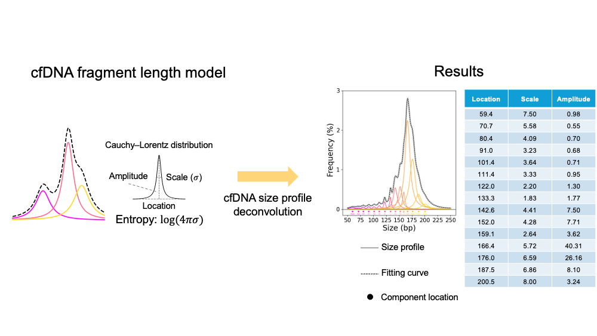

# cfDNA Size Deconvolution Analysis

This project provides tools for deconvoluting cell-free DNA (cfDNA) fragment size profiles using the Cauchy–Lorentz distribution.
The deconvolution analysis based on non-linear curve fitting algorithm implimentated by LMFIT module <https://lmfit.github.io/lmfit-py/>.

Each distribution in the size profile is modeled as a component, with three parameters estimated per component: center, scale, and amplitude.


* Installation
  
Install required Python modules with:
```
    pip install -r requirements.txt
```

* Example Data
 
example_size.txt: size profile of an example plasma cfDNA sample.
```
  - Column 1: Fragment length
  - Column 2: Fragment count at the corresponding length
```

* Usage
```
python size_decov.py
```
Apply two fitting models to the example size profile:
  1) Ordinary size deconvolution
  2) Size deconvolution with constrains
  3) Size deconvolution with constrains and L2 regularization
